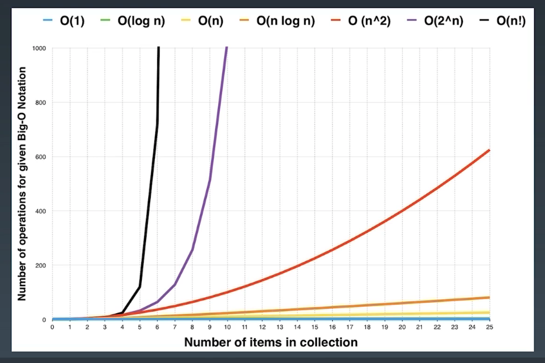
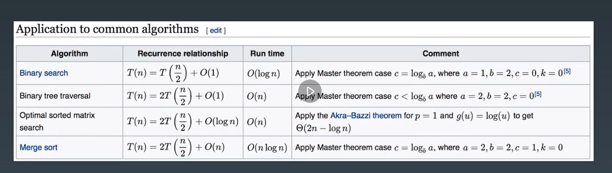
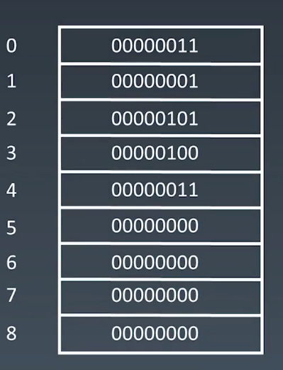
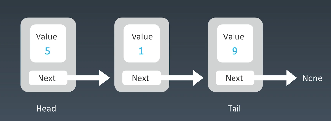
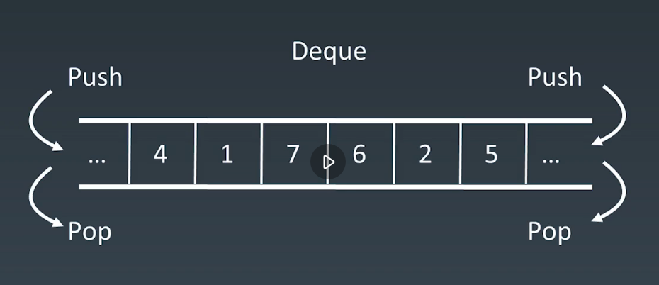
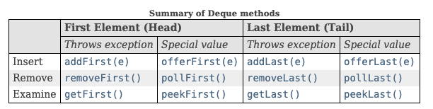
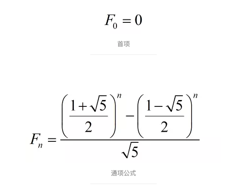

# 学习笔记

## 学习方法

### 精通一个领域的三步走

1. 切碎知识点, 形成脉络化的脑图
2. 刻意训练
    - 通过**五毒神掌刷题法**进行反复练习, 过遍数
    - 针对缺陷和弱项进行专项练习
3. 反馈
    - 通过学习高手代码, 主动发现更优解
    - 通过别人Code Review, 被动的发现更优解

五毒神掌刷题法:
1. 第一遍, 5-10分钟进行读题和思考, 
**不死磕**, 如果没有思路, 直接看好的解法, 背诵;
确定解法的时空复杂度
2. 自己写或者默写好的解法
3. 过了一天之后, 再次重复写
4. 过了一周后, 再次重复写
5. 恢复性训练, 一段时间后, 再次重复写

### 解题四步走

1. 弄清题意, 通过不断沟通确定题意
2. 思考所有可能的解法, 并比较各种解法的时空复杂度, 寻找最优解
3. 开始解题, 使用**自顶向下的编程方法**, 通过伪代码来描述整个思路, 然后进行实现
4. 提供多个场景的测试, 验证解题的正确性

如何进行思考:
- 是否可以暴力求解, 遍历所有值
- 通过举例基本的场景, 寻找重复性的规律, 得出解题公式

### 基本功

- 掌握常用的使用技巧
    + OS常用技巧
    + IDE常用技巧
- CodeStyle

## 算法分析

算法分析指对一个算法所需要的资源进行预测, 通常为运行时间, 内存等资源.

算法的运行时间指在指定规模的输入时, 所执行的基本操作数.

- 时间复杂度, 用于表示算法运行时间的增长率, 用大O表示;
一般会考虑**平均情况和最坏情况**下的时间复杂度.
- 空间复杂度, 用于表示算法运行使用的内存的增长率;
主要看以下2个因素:
    + 数组的长度
    + 递归的深度, 每次递归会额外新增一个栈帧

递归的时间复杂度分析:
- 根据递归的执行顺序, 画出递归状态的递归树
- 主定理

## 数组

数组在申请时, 会申请一段**连续的固定大小**的内存空间.

通过下标进行随机访问的时间复杂度为O(1);
增加/删除元素需要移动其后的元素, 时间复杂度为O(n).

详见[Java ArrayList Doc](https://docs.oracle.com/en/java/javase/11/docs/api/java.base/java/util/ArrayList.html)

- 初始化的时候需要指定大小
- add, 如果大小不够了, 会进行自动扩容
- remove, 如果元素在最后, 直接置为null, 否则就会向前移动元素

添加/删除需要移动的元素的数量为**s - index**, 
s为当前数组元素的数量, index为要删除的元素的位置

## 链表

非连续的, 容量没有限制, 通过指针指向下一个结点;
不能进行随机访问

- 单链表
- 双向链表
- 循环链表

进行添加/删除元素的时候, 只需要调整指向即可, 时间复杂度为O(1);
访问元素需要遍历链, 时间复杂度为O(n).

链表操作的重点就是关于指向(next/prev)的调整, 多练, 孰能生巧.

详见[Java LinkedList](https://docs.oracle.com/en/java/javase/11/docs/api/java.base/java/util/LinkedList.html)

LinkedList是一个双向链表

## 栈和队列

只能在一端进行操作

- 栈: 先入后出(FILO), 适合于解决最近相关性问题
- 队列: 先进先出(FIFO)

它们的添加/删除的时间复杂度都为O(1);
查询为O(n)

参考[Java Stack](https://docs.oracle.com/en/java/javase/11/docs/api/java.base/java/util/Stack.html)
和[Java Queue](https://docs.oracle.com/en/java/javase/11/docs/api/java.base/java/util/Queue.html)

### 双端队列

它类似于栈和队列的结合, 可以在两端进行操作.
在工程中, 一般推荐使用Deque代替Stack和Queue.

参考[Java Deque](https://docs.oracle.com/en/java/javase/11/docs/api/java.base/java/util/Deque.html)

一般使用链表形式的Deque, 即没有长度限制;
但也有长度受限的数组形式的deque.

Deque针对失败的处理提供了2套接口: 抛异常和返回null/false.
而返回null/false的接口一般用于数组形式的deque.

### 优先队列

数据会保持一定的**有序性**.
底层具体实现的数据结构较为多样和复杂, 可以使用heap, BST, treap等实现

- 插入操作: O(1)
- 取出操作: O(log n), 按照元素的优先级取出

参考[Java PriorityQueue](https://docs.oracle.com/en/java/javase/11/docs/api/java.base/java/util/PriorityQueue.html)

Java的优先级队列是基于堆(heap)实现的, 元素被存储在数组中, 
会根据元素的多少进行自动扩容.
其中的元素会按照自然排序或者基于Comparator接口进行排序.

## 解题思路

### 数组变换 --- 快慢指针

一般慢指针指向要被替换的位置, 快指针用于遍历元素.

### 斐波那契数列

斐波那契数列的递推公式: f(n) = f(n-1) + f(n-2)

任何满足这个递推公式的问题, 可以用以下的解法:
- 需要3个值, 用于保存**当前值, 前面第一个的值, 前面第二个的值**.
- 直接套用斐波那契数列的通式

### 左右指针

一般用于**有序**的线性结构, 通过移动左右指针向中间**夹逼**.

### 表达式有效性检查

最近相关性问题一般会采用栈来解决.

### 辅助队列/栈

一般通过2个队列/栈来解决问题

## 训练题目

- [移动零](https://leetcode-cn.com/problems/move-zeroes/)
- [爬楼梯](https://leetcode-cn.com/problems/climbing-stairs/)
- [盛水最多的容器](https://leetcode-cn.com/problems/container-with-most-water/)
- [2数之和](https://leetcode-cn.com/problems/two-sum/)
- [3数之和](https://leetcode-cn.com/problems/3sum/)
- [加一](https://leetcode-cn.com/problems/plus-one/)
- [删除排序数组中的重复项](https://leetcode-cn.com/problems/remove-duplicates-from-sorted-array/)
- [反转链表]()
- [旋转数组]()
- [合并两个有序链表]()
- [合并两个有序数组]()
- [两两交换链表中的结点](https://leetcode-cn.com/problems/swap-nodes-in-pairs/)
- [环形链表](https://leetcode.com/problems/linked-list-cycle)
- [环形链表 II](https://leetcode-cn.com/problems/linked-list-cycle-ii/)
- [K个一组翻转链表](https://leetcode-cn.com/problems/reverse-nodes-in-k-group/)
- [有效的括号](https://leetcode-cn.com/problems/valid-parentheses/)
- [最小栈](https://leetcode-cn.com/problems/min-stack/)
- [柱状图中最大的矩形](https://leetcode-cn.com/problems/largest-rectangle-in-histogram/)
- [滑动窗口的最大值](https://leetcode-cn.com/problems/sliding-window-maximum/)
- [设计循环双端队列](https://leetcode-cn.com/problems/design-circular-deque/)
- [接雨水](https://leetcode-cn.com/problems/trapping-rain-water/)

## 参考

- [如何理解算法时间复杂度的表示法](https://www.zhihu.com/question/21387264)
- [主定理](https://zh.wikipedia.org/wiki/%E4%B8%BB%E5%AE%9A%E7%90%86)