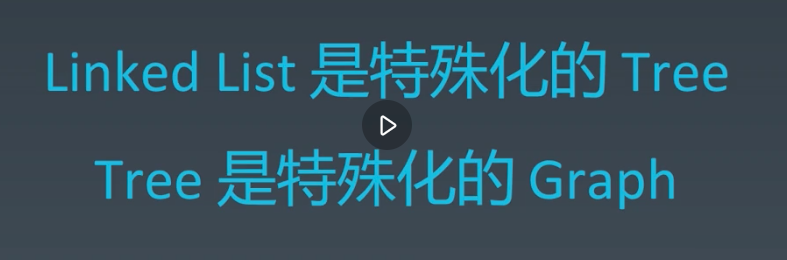
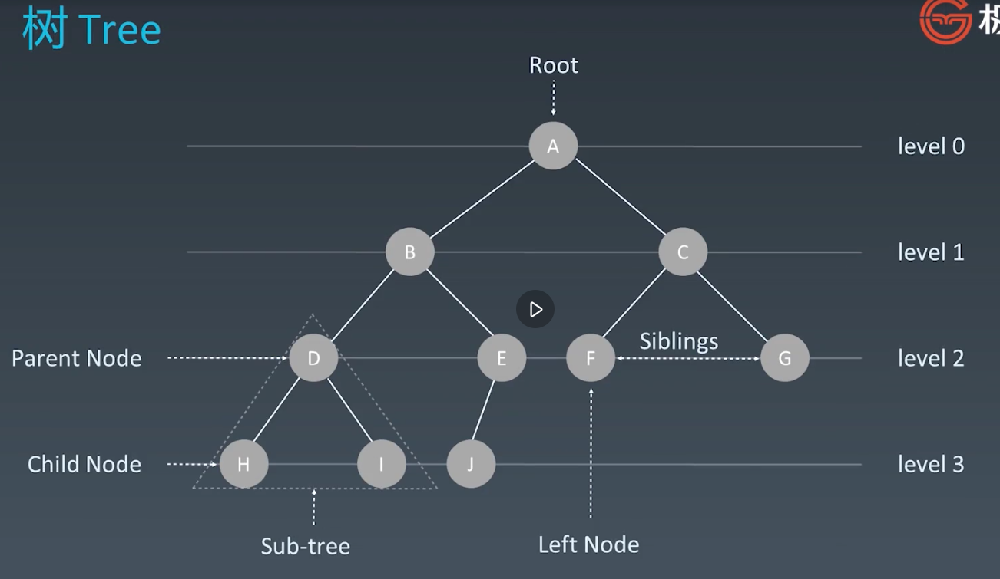
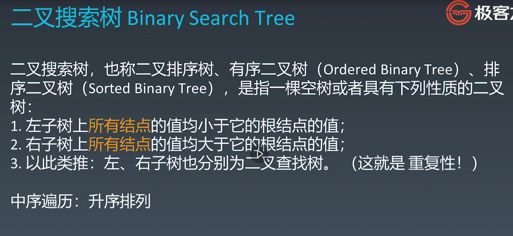
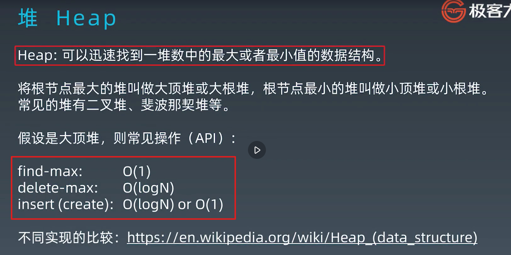
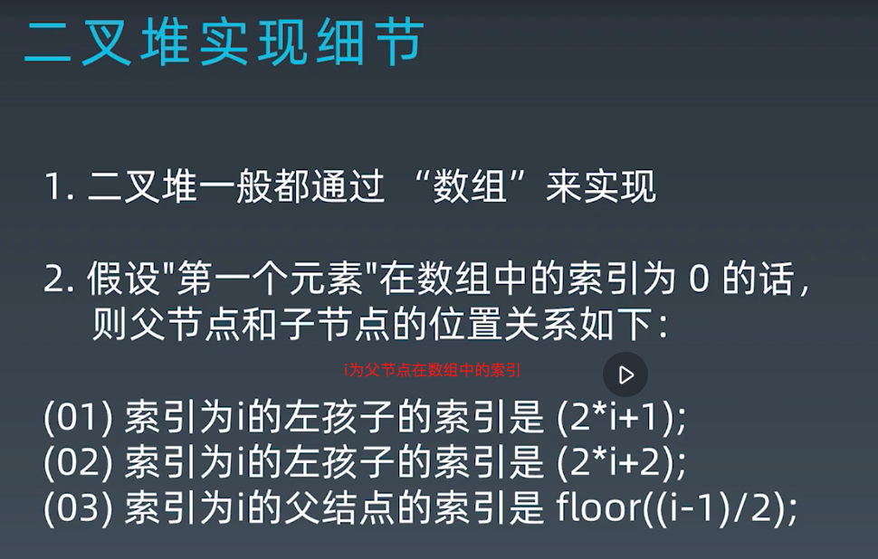
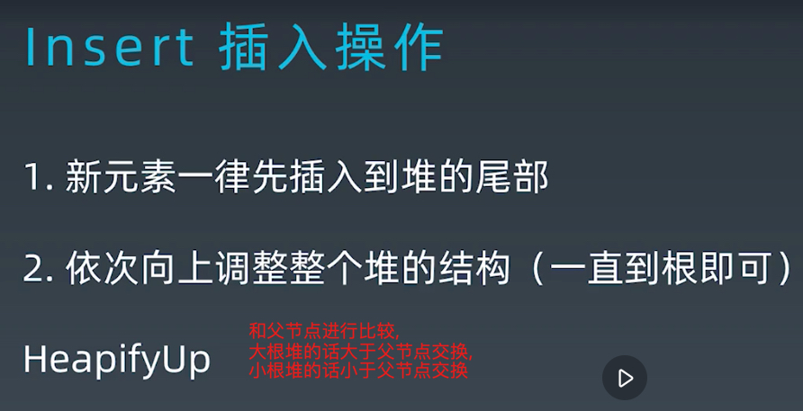
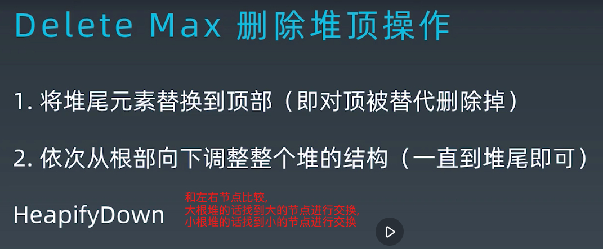
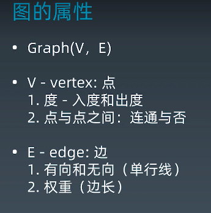
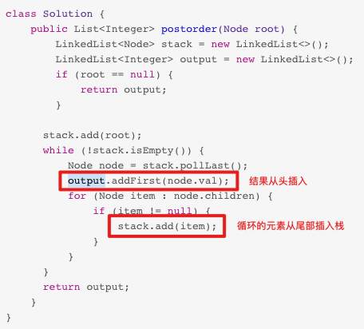

# Week2 学习笔记

## 哈希表(Hash Table)

根据关键码值(key)来访问数据, 
通过**哈希函数**把key映射到哈希表中一个位置来访问记录, 
加快查询速度.

哈希碰撞: 不同的数据经过哈希函数后得到相同的哈希值;

解决哈希碰撞:
- (工程上常用)拉链式解决冲突, 增加一个维度, 即哈希值的位置存一个链表
- 开放寻址法, 依次往下寻找空闲位置
    + 线性探测
    + 二次探测
    + 双重探测

- 参考[Java Hashtable](https://docs.oracle.com/en/java/javase/11/docs/api/java.base/java/util/Hashtable.html)
- 参考[Java HashMap](https://docs.oracle.com/en/java/javase/11/docs/api/java.base/java/util/HashMap.html), put和get
- 参考[Java HashSet]()

### HashMap

- 哈希表使用数组存储位置, 每个位置上的元素被存储到链表, 
即采用了拉链式解决哈希碰撞
- 对key使用哈希函数进行处理
- 自动扩容
- 位置计算

参考:
- [JDK11版HashMap源码全部解析(详细)](https://blog.csdn.net/qq_21845263/article/details/89604721)

## 树(Tree)

树的问题解决一般都是**递归**

### 二叉树(Binary Tree)

只有左右两个节点的树

二叉树的遍历, 看根节点的位置:
- 前序, 根左右
- 中序, 左根右
- 后序, 左右根

查找一个元素的时间复杂度: O(n)

### 二叉搜索树(Binary Search Tree)

有序的二叉树

**中序遍历**得到的列表中的元素是按**升序排列**

二叉搜索树的查询/添加/删除的时间复杂度: O(log n)

删除拥有左右节点的根节点时, 需要把左边最大(左子树的最右边)或者右边最小的节点(右字数的最左边)提升为根节点.

## 堆(Heap)

迅速找到一堆数中的最大或者最小的数据结构,
它的实现方式有很多, 

参考[Java PriorityQueue]()

### 二叉堆

- 是一棵完全二叉树
- 根节点的值最大, 树中任意节点的值 >= 左/右节点的值

参考[Java BinaryHeap]()

## 图(Graph)

- 邻接矩阵
- 邻接表

## 解法

递归可以通过**栈+循环**来模拟.

## 题目

- [有效的字母异位词](https://leetcode-cn.com/problems/valid-anagram/description/)
- [字母异位词分组](https://leetcode-cn.com/problems/group-anagrams/)
- [二叉树的前序遍历](https://leetcode-cn.com/problems/binary-tree-preorder-traversal/)
- [二叉树的中序遍历](https://leetcode-cn.com/problems/binary-tree-inorder-traversal/)
- [N 叉树的前序遍历](https://leetcode-cn.com/problems/n-ary-tree-preorder-traversal/description/)
- [N 叉树的后序遍历](https://leetcode-cn.com/problems/n-ary-tree-postorder-traversal/)
- [N 叉树的层序遍历](https://leetcode-cn.com/problems/n-ary-tree-level-order-traversal/)
- [最小的 k 个数](https://leetcode-cn.com/problems/zui-xiao-de-kge-shu-lcof/)
- [滑动窗口最大值](https://leetcode-cn.com/problems/sliding-window-maximum/)
- [丑数](https://leetcode-cn.com/problems/chou-shu-lcof/)
- [前 K 个高频元素](https://leetcode-cn.com/problems/top-k-frequent-elements/)